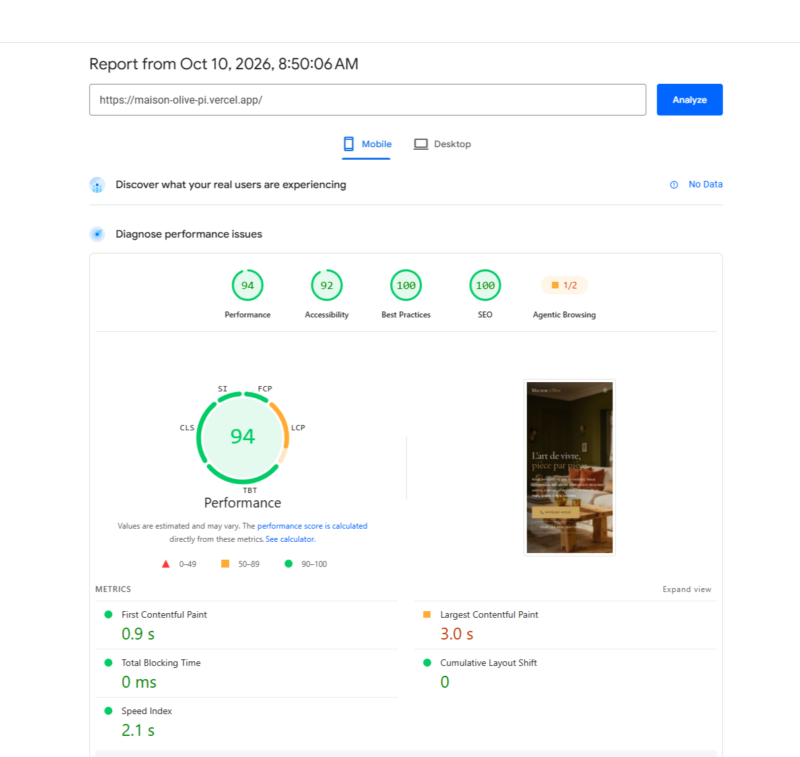

# Maison Olive

A modern interior design website concept showcasing refined interiors, editorial visuals, and a premium brand experience.

**Live Demo:** https://maison-olive-pi.vercel.app/  
**Repository:** https://github.com/yamami-mohammed-monsif/Maison-Olive

## Overview

Maison Olive is a personal portfolio project built to explore how an interior design brand can present its identity, showcase its aesthetic, and guide visitors toward making contact through a visually immersive, conversion-conscious interface.

The project combines modern frontend development with responsive UI design, editorial typography, interior imagery, reusable components, clear calls to action, and animated visual effects.

## Conversion Strategy

The page was structured around a simple visitor journey: communicate the brand's identity, showcase its design aesthetic, build interest, and guide potential clients toward making an inquiry.

### CTA hierarchy

Prominent calls to action give visitors a clear next step, helping them move from exploring the brand toward contacting the business.

### Visual storytelling

Interior imagery, typography, spacing, and section composition work together to communicate the brand's aesthetic and help visitors understand its design style.

### Brand positioning

The visual presentation aims to create a consistent, premium brand experience through a restrained layout, carefully structured content, and cohesive visual elements.

### Reducing friction

Clear navigation and accessible contact calls to action make it easier for interested visitors to find the next step without navigating through unnecessary complexity.

### Conversion flow

The page follows a deliberate structure:

**Brand introduction → Visual storytelling → Design exploration → Contact CTA**

The goal was to create a cohesive browsing experience that communicates the brand's value and makes contacting the business a clear next step.

These are design hypotheses rather than measured conversion outcomes. No conversion uplift is claimed because the project has not been validated through production analytics or controlled experiments.

## Performance & Technical Optimization

Performance was evaluated as part of the user experience, particularly for mobile visitors.

The implementation uses Next.js, responsive layouts, reusable React components, and animated UI elements to create an interactive browsing experience.

### Mobile Lighthouse / PageSpeed Insights

- **Performance:** 94/100
- **SEO:** 100/100
- **Best Practices:** 100/100
- **Accessibility:** 92/100
- **Largest Contentful Paint:** 3.0s
- **First Contentful Paint:** 0.9s
- **Total Blocking Time:** 0ms
- **Cumulative Layout Shift:** 0
- **Speed Index:** 2.1s

These results were measured using Google PageSpeed Insights and can vary between test runs.

The next performance improvement would focus on reducing Largest Contentful Paint, starting with an investigation of the hero image's loading priority, dimensions, format, and delivery.

## Performance Evidence

Mobile PageSpeed Insights test:



## Features

- Editorial-style hero section with interior imagery
- Responsive layouts for mobile and desktop
- Clear navigation and contact calls to action
- Structured content sections for presenting the brand and its work
- Reusable React components
- Animated UI transitions
- Responsive visual presentation
- Component-based page architecture
- Deployment on Vercel

## Tech Stack

- Next.js
- React
- TypeScript
- Tailwind CSS
- Framer Motion
- Lucide React
- Vercel

## Project Structure

The application uses a component-based architecture to organize the page and its interactive sections.

- Main page
- Shared layout and styling
- Client-side interactive sections
- Reusable UI components
- Animation and reveal effects

This structure separates page composition, styling, and reusable interface elements, making the project easier to maintain and iterate on.

## Development Approach

This project was developed as a personal portfolio project with AI-assisted development. AI tools were used during implementation and iteration, while the resulting code and interface were reviewed and adapted as part of the development process.

## Getting Started

Clone the repository and install the dependencies:

```bash
git clone https://github.com/yamami-mohammed-monsif/Maison-Olive.git
cd Maison-Olive
npm install
```

Run the development server:

```bash
npm run dev
```

Open http://localhost:3000 in your browser.

## What I Focused On

The main goals of the project were to practice:

- Building production-style interfaces with Next.js
- Creating reusable React components
- Developing responsive layouts with Tailwind CSS
- Combining typography, imagery, and spacing into a cohesive visual identity
- Applying UX and CRO principles to navigation and CTA placement
- Using animations to enhance the browsing experience
- Evaluating mobile performance with Google PageSpeed Insights
- Combining visual design with practical frontend implementation

## CRO Testing Roadmap

Because this is a portfolio project without production conversion data, no conversion uplift is claimed.

If deployed for a real interior design business, the next step would be to establish baseline analytics and test hypotheses such as:

- Hero headline and CTA wording
- Contact CTA placement and visibility
- Portfolio or project-section engagement
- The order and presentation of visual content
- Mobile navigation and contact interactions
- Inquiry-form friction, if a form is introduced
- Mobile versus desktop visitor behavior

The goal would be to use analytics and controlled experiments to determine which changes improve meaningful engagement and qualified inquiries rather than relying solely on design assumptions.
